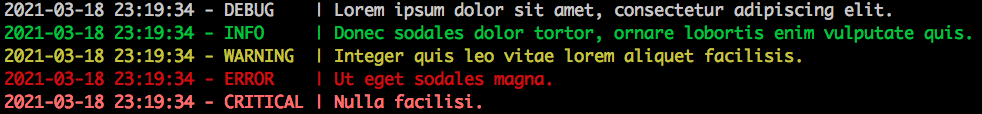

<!-- PROJECT DESCRIPTION -->
<br />
<p align="center">
  <h3 align="center">Colorized Log Sample</h3>
  <p align="center">
    Minimal sample project using colorized logs
  </p>
</p>

<!-- TABLE OF CONTENTS -->
<details open="open">
<summary><h2 style="display: inline-block">Table of Contents</h2></summary>

- [About the Project](#about-the-project)
  - [Built With](#built-with)
- [Getting Started](#getting-started)

</details>
<br>

## About the Project
This project is intended to be a minimal working sample of colorized logs
using the `colorlog` package. 

The colorized logger is initialized by importing the sample `mypackage`
package, or, in general, any module within it (none is provided with
this project). This 'magic' is achieved by including the logging
initialization code in the package's `__init__.py` file. In a real-life
project, this code could be added, for example, to the project's main
package's init file, or a specific script.

During initialization, the logger configuration is obtained from the
`logging.yaml` file in the project's root folder. While this file should
usually be excluded from source control (e.g., by adding it to .gitignore),
it has been included in this project for reference, along with an extended
sample in the `logging.sample.yaml` file.

This solution has been successfully tested in macOS, Linux (Ubuntu 20.04),
and Windows 10 (PowerShell).

For specifics on Python's `logging` or the `colorlog` packages, please
refer to documentation links [below](#built-with).

<br>

### Built With

* [Python](https://www.python.org)
* [logging](https://docs.python.org/3/library/logging.html)
* [colorlog](https://pypi.org/project/colorlog/)

<br>

## Getting Started

1. Clone the repository or download the source code from github. For example:

   ```sh
   git clone https://github.com/phergo/colorized-log-sample.git
   ```

2. (Optional; Recommended) Create/Activate a virtual environment
   (virtualenv, conda, ...)
   
3. Install the requirements.
   
   ```sh
   pip install -r requirements.txt
   ```

4. Run the sample script
   
   ```sh
   python sample.py
   ```

    The output should look similar to this:

   